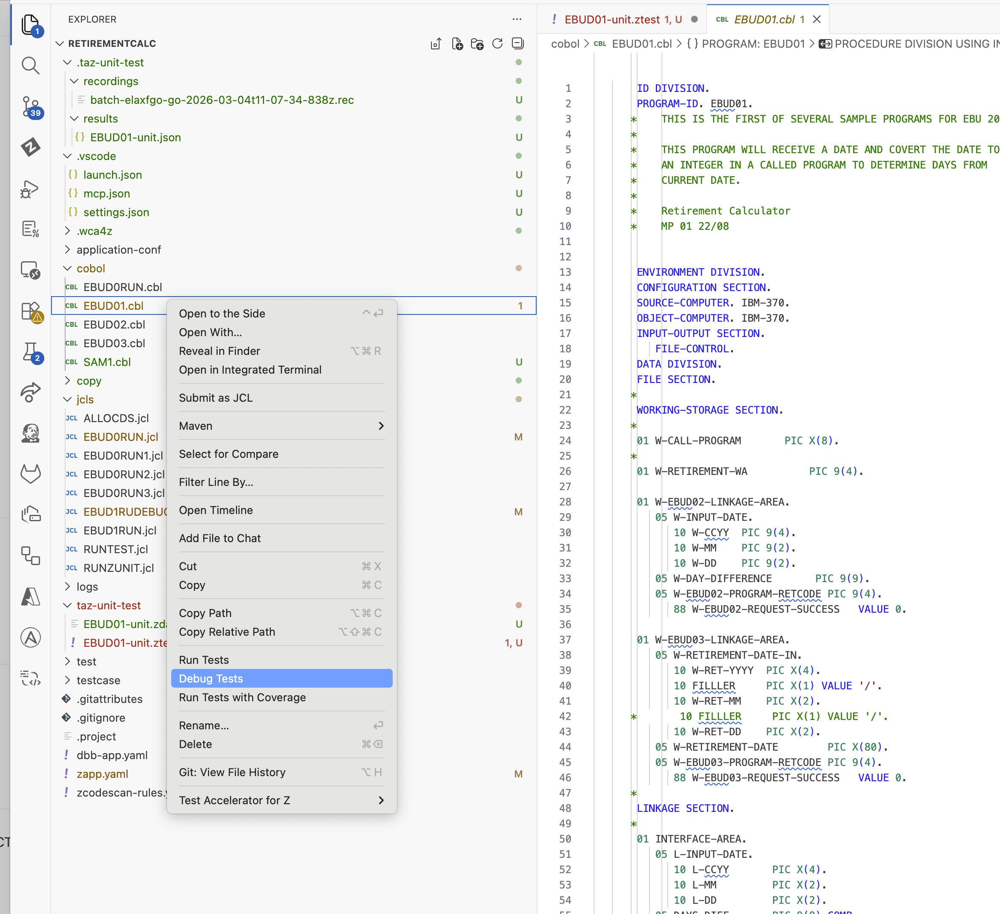

# replay-context-menu-on-cobol-files

Rather a question/observation: 

What's the purpose of the actions in the context menu?

I am not able to run the associated tests for the cobol program from here.

